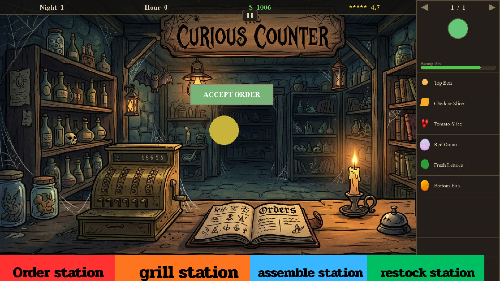
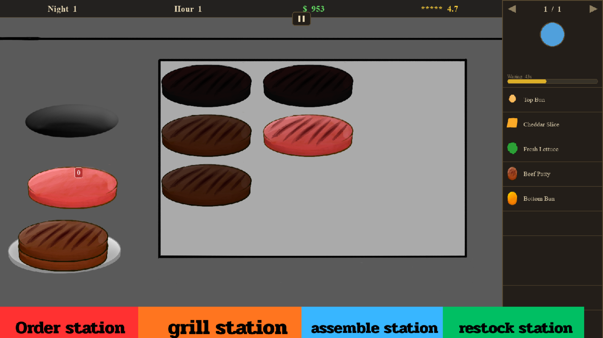
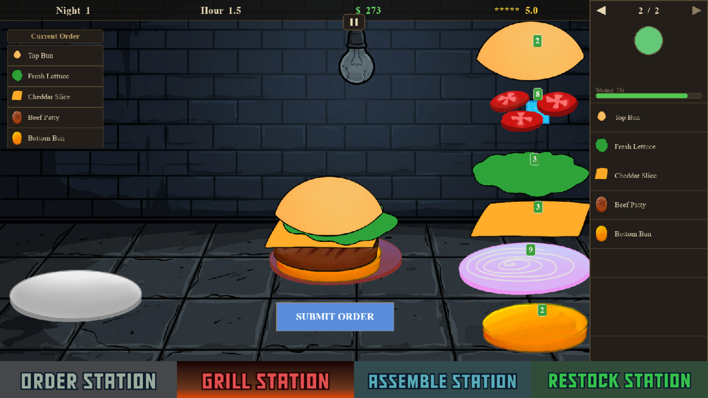
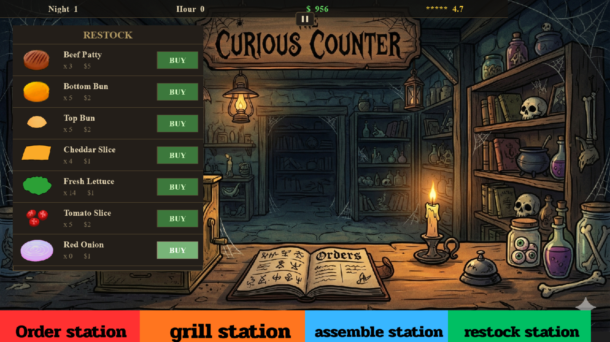
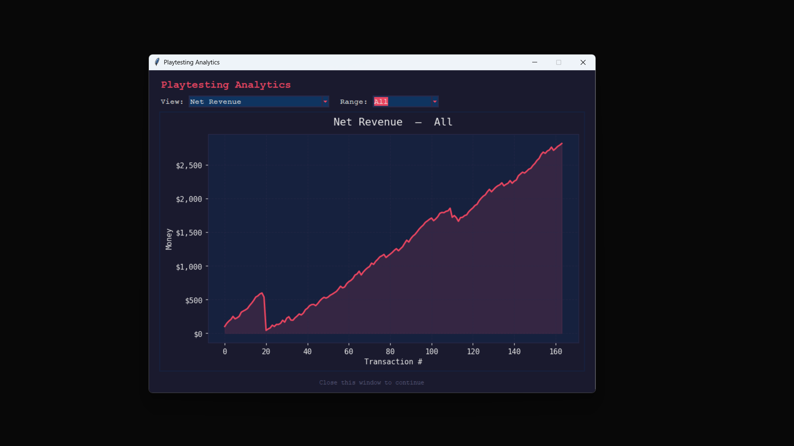
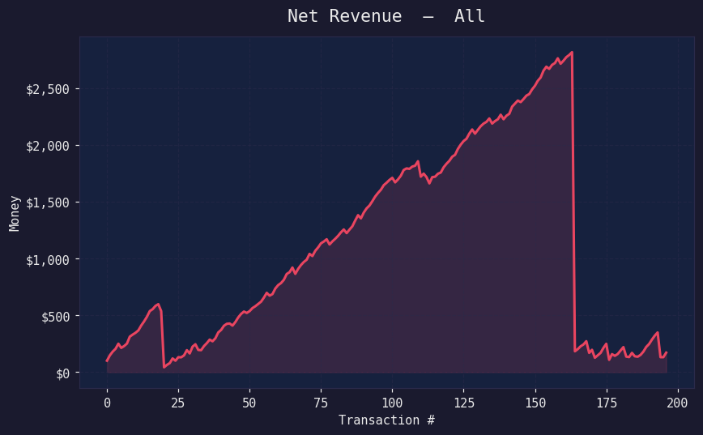
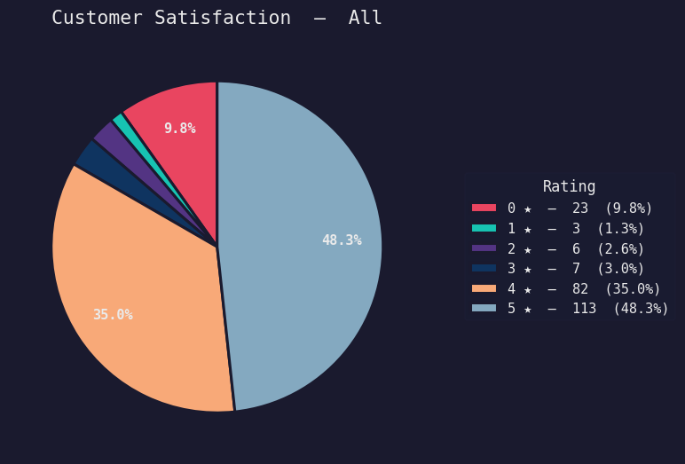
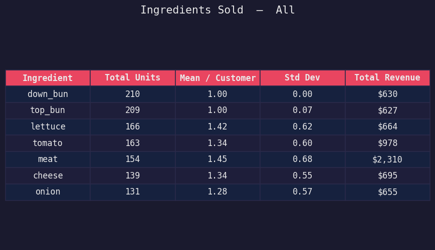
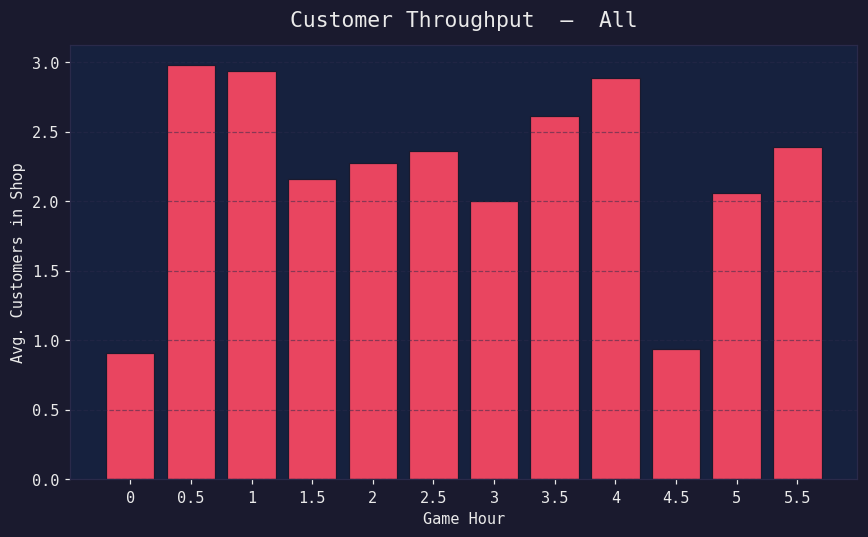
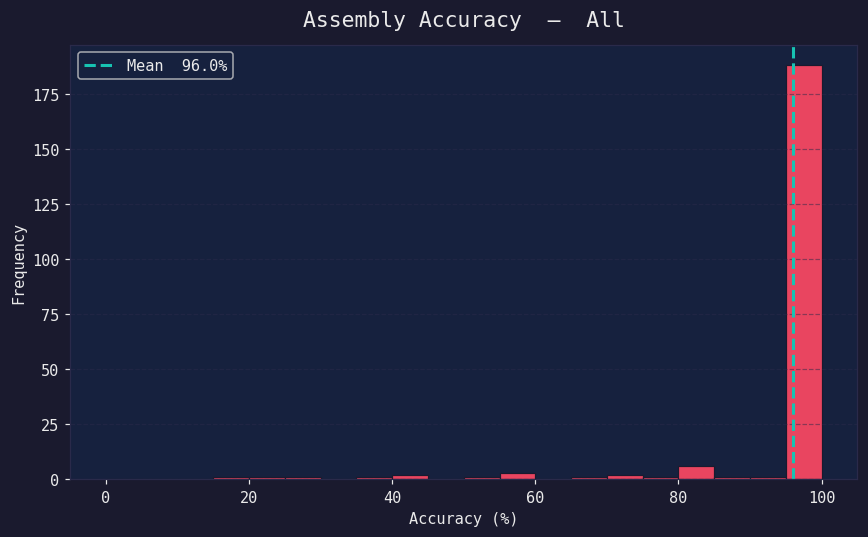

# Midnight Griddle — Project Description

---

## 1. Project Overview

### Project Name
**Midnight Griddle** — a late-night burger-stand time-management game with a built-in playtesting analytics dashboard.

### Brief Description
Midnight Griddle is a time-management and cooking simulation game built with **Python** and **Pygame**. You play as the lone server at a late-night burger stand, juggling four stations — taking orders, grilling patties, assembling burgers, and restocking ingredients — across a six-hour in-game shift. Each customer carries two patience meters (one for ordering, one for waiting on food), and your goal is to keep your average satisfaction rating from sliding below 2 stars before the clock runs out. 

The project ships with a **Tkinter + Matplotlib analytics dashboard** that logs every transaction to CSV and renders five live charts: revenue trends, customer satisfaction breakdown, throughput, assembly accuracy, and ingredient sales. The game and the dashboard are designed to work together — every shift you play becomes a dataset you can immediately inspect.

### Problem the Project Solves
Most cooking sims are tuned by feel. Midnight Griddle treats balance and player behaviour as a *measurable* thing: prices, patience timers, spawn rates, and rating weights all feed a clean CSV pipeline that surfaces in-game analytics. The result is a playable demo that doubles as a teaching harness for game-design instrumentation.

### Target Users
- Casual players who enjoy fast-paced cooking sims (Overcooked, Diner Dash, Cook Serve Delicious style)
- Game-design students learning how to instrument, log, and balance their own games
- Playtesters and educators who want a small, self-contained example of an analytics-friendly game loop

### Key Features
- **Four interactable station** — Order, Grill, Assemble, Restock 
- **Drag-and-drop system**
- **Assembling Ingredients system**
- **Grill simulation with** `precook → raw → cooked → burnt` states 
- **HUD** (night, hour, money, average rating) 
- **Two-stage customer patience** — separate ordering and waiting timers
- **Composite 1–5 star rating**: 60% assembly accuracy + 20% ordering speed + 20% serving speed (accuracy gates the bonuses)
- **Persistent save state** — money, stock, ratings, and night counter persist across sessions via CSV
- **Restock shop** driven by a single `ItemData` source of truth
- **6-hour shift clock** with fail (`avg rating < 2`) and complete states
- **Analytics dashboard** with `Last 100` / `All` toggle and five chart views

### Screenshots

**Gameplay**






**Analytics Dashboard**








### Proposal
📄 [Project Proposal (PDF)](project_proposal.pdf)

### Video Presentation
🎥 [Watch the 7-minute presentation on YouTube](https://youtu.be/i6wEhqQTJhs)

---

## 2. Concept

### 2.1 Background

I enjoy cute but somewhat spooky games, and while I was thinking about a game idea, an idea popped up. Why don't we make a burger stand where we sell items in a spooky place? My friend suggested Papa's Burgeria, and to my surprise the gameplay is very solid, so that became the inspiration for the game. The problem with Papa's game is that there's no time limit, but to make something spooky there must be some sort of tension. So that's why I added a rating to the game.

### 2.2 Objectives

The goal of the system is to make the player feel like they're actually cooking and making the burger for the customer. What I want to achieve is drag and drop, assembly, taking orders, and submitting orders, so that the player really feels they are working at a burger stand. Not only that, the goal is also to make player feel a tension. Hence, I create a rating system to ensure player have a tension. To prevent players from surviving while doing nothing. The customer will give 0 star rating if you didn't pick up the order or serve on time.

---

## 3. UML Class Diagram

The diagram below shows every class implemented in the project, the inheritance hierarchies, and the main composition relationships. The Mermaid source is embedded for GitHub rendering; see  `uml_diagram.pdf` for the attachable PDF version.

[UML](https://github.com/nonkrub123/Midnight-Griddle/UML.pdf)
---

## 4. Object-Oriented Programming Implementation

Every class implemented in the project, grouped by module and with a one-paragraph description of its role.

### `core/gamemanager.py`
- **`GameManager`** — top-level orchestrator. Owns the pygame display, the 1920×1080 logical game surface (scaled to fullscreen), the `InputHandler`, the active `StationManager`, and the menu state machine (`menu` / `playing` / `paused` / `gameover` / `complete`). Builds the four `MenuScreen` variants and routes per-frame work to either `playing()` or `handle_menu()`.

### `core/gamedata.py`
- **`GameHour`** — lightweight clock that converts real seconds into game hours. Configurable `real_seconds_per_hour` and `total_hours`. Exposes `current_hour`, `hour_label` (snapped to 0.5 increments), `is_over`, and `progress`.
- **`GameData`** — persistent shift state. Owns money, night counter, rating history, and per-item stock. Public API for spending/earning money, restocking via `ItemData`'s `buy_price`, and serialising the lot to a CSV save file. `restart_data()` wipes for a new shift.

### `core/inputhandler.py`
- **`InputHandler`** — pure mouse-event router. Remaps OS-space cursor coordinates to game-space (so the logical canvas works on any screen), distinguishes click from drag using a time threshold, and dispatches to whichever group owns the sprite under the cursor. Tracks a single held item and its owning group during a drag.

### `core/itemdata.py`
- **`ItemData`** — static "database" of every placeable item. One `DATABASE` dict keyed by `item_id`, with type tags (grillable/ingredient/object/ui), display name, weight, layer priority, prices, and per-state image filenames. Static helpers for property lookup, image loading (routes filenames to the correct asset folder by type), and bulk queries (`get_ingredients`, `get_grillables`, `get_all_edible`).

### `core/menuscreen.py`
- **`MenuScreen`** — `BaseGroup` subclass that builds a centered title + vertical button list on a dimmed backdrop. Reused for the four menu screens (main, pause, gameover, complete) — pass in a title and a list of `(label, callback)` tuples.

### `core/settings.py`
- **`GamePath`** — static path resolver. Centralises asset/data folder lookups (`get_grillable`, `get_ui`, `get_ingredients`, `get_station`, `get_gamedata`, …) so files can be reorganised without breaking imports.

### `core/stattracker.py`
- **`StatTracker`** — frame-tick stat logger. Accumulates `real_elapsed_s`, samples customer count every `throughput_interval` (default 10s), and exposes `log_revenue` / `log_satisfaction` / `log_throughput` / `log_accuracy` / `log_ingredients` writers. The static `compute_rating(ordering_ratio, accuracy_pct, waiting_ratio)` produces a 0–5 star score using the formula `accuracy × (0.60 + 0.20 × ordering + 0.20 × waiting)`.

### `core/stat_viewer.py`
- **`StatViewer`** — Tkinter window with two `ttk.Combobox` dropdowns (View, Range). Every selection regenerates one of five Matplotlib charts and reloads the displayed PNG. `show_stat()` is the public entry point and blocks until closed. Uses Matplotlib's `Agg` backend so off-screen rendering doesn't clash with pygame.

### `core/audiomanager.py`
- **`AudioManager`** — Singleton wrapper around `pygame.mixer`. Holds class-level `SOUNDS` and `MUSIC` registries; preloads SFX into a cache on first use and streams music lazily. Exposes `play_sound` / `play_sound_loop` / `stop_sound` for SFX, `play_music` / `stop_music` / `next_music` / `play_playlist` for music, and `pause_all` / `resume_all` / `kill_all_sounds` for global control. Volume is split into `sfx_volume` and `music_volume`, set via `set_sfx_volume` / `set_music_volume`.

### `ui/factory.py`
- **`ItemFactory`** — builds `InteractiveObject` subclasses from `ItemData`. Caches loaded image surfaces by `{type}_{filename}` so repeat creations don't re-hit disk. Helpers `create_base_plate` and `create_invisible_plate` produce stack anchors and transparent drop zones.

### `ui/interactive.py`
- **`InteractiveObject`** — base draggable/clickable sprite. Pygame `Sprite` + smooth target-position lerping (`set_target`, `_move`) + tag lookup (`has_tag`) that defers to `ItemData`. Holds `current_group` so a snapback knows where home is.
- **`GrillableItem`** — `InteractiveObject` that tracks cook progress (`_time_on_grill`), advances through `precook → raw → cooked → burnt`, and applies a darkening RGB-multiply tint that scales with progress. `cooked` threshold is 50% of `max_cook_time`; `burnt` is 150%.
- **`IngredientItem`** — trivial `InteractiveObject` specialisation; exists for symmetry and future hooks.
- **`BasePlate`** — `InteractiveObject` that always reports `draggable=False` and `clickable=False`. Used as the bottom-of-stack anchor for `StackGroup`.
- **`StaticUI`** — locked, non-interactive sprite for panels, banners, badges, HUD text. Stores its own anchor keyword so `set_surface()` can swap the image while keeping placement.
- **`UIButton`** — clickable-but-not-draggable `InteractiveObject` with a callback. Accepts a path, a `Surface`, or `{"default": Surface}` as image input.

### `ui/group.py`
- **`BaseGroup`** — `pygame.sprite.LayeredUpdates` subclass. Adds the four-handler protocol used by `InputHandler`: `handle_click`, `handle_drag`, `handle_drop`, `handle_snapback`. Default snapback re-adds a sprite to its remembered home group.
- **`StackGroup`** — `BaseGroup` variant that stacks ingredients vertically using each item's `pixel_height`. Maintains an invisible base plate at the bottom and an optional top hitbox above the stack so drops on the top can be intercepted. `_restack_all()` runs the lerp animation whenever items move.
- **`GrillGroup`** — `StackGroup` that only accepts grillables and ticks `on_cook()` for every grillable on it each frame.
- **`PlateGroup`** — `StackGroup` that only accepts ingredients. Adds `get_item_names()` and `get_items_with_state()` for accuracy scoring at order submission.
- **`TrayGroup`** — travelling plate carried between `GrillStation` and `AssembleStation`. Same accept rules as `PlateGroup`.
- **`DispenserGroup`** — `StackGroup` with capacity 0 that holds a single "template" ingredient. Dragging the template consumes one stock and spawns a fresh template; snapback returns the stock. Renders a numeric stock badge above the dispenser via `_StockLabel`.
- **`_StockLabel`** — `StaticUI` specialisation that renders a green-or-red rounded badge with the current stock count.
- **`TrashGroup`** — `BaseGroup` whose `handle_drop` kills any sprite that isn't tagged `undeletable`.

### `ui/hud.py`
- **`HUDGroup`** — `BaseGroup` rendering the always-on-top status bar (night, hour, money, average rating). `refresh(game_hour, gamedata)` rebuilds the four label surfaces every frame.

### `ui/orderui.py`
- **`OrderUI`** — side panel that shows the queue of accepted orders the player is currently building toward. Shared between stations so the UI stays consistent when the player switches screens.
  > *Note: source for this file wasn't included in the upload — verify and expand this paragraph from your code.*

### `ui/theme.py`
- *(Module of constants and helper functions — no classes.)* Centralises the colour palette, screen-fraction helpers (`sw`, `sh`), font factory (`font(size, bold)`), button surface builder (`button_surface`), and every layout position used across stations.

### `stations/station.py`
- **`Station`** — abstract base for the four stations. Holds a background image, a list of registered groups, and the standard `update(dt)` / `draw_background()` / `get_all_groups()` methods.
- **`OrderStation`** — hosts the customer line, the order ticket, and the accept button.
- **`GrillStation`** — hosts the grill grid, the meat dispenser, and the travelling tray.
- **`AssembleStation`** — hosts the final plate, the ingredient dispensers, the trash, and the submit button. Responsible for scoring an order against the customer's request via `StatTracker.log_accuracy` / `compute_rating`.
  > *Note: source for `station.py` wasn't included in the upload — verify and expand the three subclass paragraphs from your code.*

### `stations/customermanager.py`
- **`CustomerManager`** — spawns customers on a randomised cadence between `min_spawn_time` and `max_spawn_time`, holds them in `on_ordering` / `on_waiting` lists, and ticks both patience meters via `update_ordering(dt)` and `update_waiting(dt)`. Returns expired customers each frame so `StationManager` can log a 0-star satisfaction event.
  > *Note: source for this file wasn't included in the upload — verify and expand from your code.*

### `stations/restock_station.py`
- **`RestockStation`** — shop screen: one row per edible item (icon, name, stock, price, BUY button). BUY routes through `GameData.restock`. Re-renders only the rows whose stock changed since last frame, so there's no full-panel redraw every tick.

### `stations/stationmanager.py`
- **`StationManager`** — owns the four `Station` instances, the shared singletons (`CustomerManager`, `OrderUI`, `HUDGroup`, `StatTracker`, `TrayGroup`, `ItemFactory`), and the bottom-nav button group. Routes `update`/`draw` to the active station and ticks the customer model exactly once per frame so spawn/patience timers don't get double-counted across station switches.

### `main.py`
- *(No classes.)* Single entry point: instantiates `GameManager` and calls `main()`.

---

## 5. Statistical Data

### 5.1 Data recording method

All gameplay stats are written as **CSV files** in `data/gamedata/` via Python's `csv.writer` in append mode. A single `StatTracker` instance is created in `StationManager` and ticked once per frame. Every event is recorded with three coordinates — the in-game half-hour bucket (`game_hour`), the real elapsed seconds since the tracker started (`real_elapsed_s`), and an event-specific payload — so the same row can be plotted against either game-time or wall-clock time.

**Five log files are maintained, one per metric:**

| File | Columns | When it's written |
|---|---|---|
| `revenue_log.csv` | `game_hour, revenue, real_elapsed_s` | One row per served customer (AssembleStation submit) |
| `satisfaction_log.csv` | `game_hour, rating, real_elapsed_s` | One row per customer outcome — including `0` when patience expires |
| `throughput_log.csv` | `game_hour, throughput, real_elapsed_s` | Sampled every `throughput_interval` seconds (default 10s); throughput = customers currently in the shop |
| `accuracy_log.csv` | `game_hour, score, max_score, accuracy_pct, real_elapsed_s` | Computed in `StatTracker.log_accuracy` by weighted item-by-item comparison |
| `ingredients_log.csv` | `game_hour, item_id, quantity, revenue, real_elapsed_s` | One row per distinct ingredient per served burger |

Headers are written automatically the first time a file is touched, so re-runs append cleanly across sessions. Persistent shift state (money, night, rating history, stock) is stored separately in `gameplay.csv` via `GameData.save()` / `load()`, which is what lets you quit and resume.

### 5.2 Data Features

The dashboard is a `Tk` window with two `ttk.Combobox` dropdowns — **View** (which chart) and **Range** (`Last 100` rows or `All`). Switching either dropdown regenerates all five PNGs via Matplotlib's off-screen `Agg` backend and re-loads the displayed image. The theme is dark (`#1a1a2e` background, `#e94560` accent) so it sits comfortably next to the game window.

**Five visualisations:**

1. **Net Revenue** — line chart of money earned per transaction with a shaded fill. Reveals revenue trend and bursts.
2. **Customer Satisfaction** — pie chart of star-rating distribution (0–5★). The composite rating is computed as `accuracy × (0.60 + 0.20 × ordering_ratio + 0.20 × waiting_ratio)`, then snapped to 0–5. Accuracy gates the bonuses, so being fast with a wrong burger never earns points.
3. **Customer Throughput** — bar graph of how many customer is in the game at each hour. We use mean to show how much customer appear in each hour.
4. **Assembly Accuracy** — histogram of `accuracy_pct` (0–100) with a vertical mean line. Per-burger score is the weighted ratio of correctly-placed items, where grillables only earn their weight if the cook state is `cooked` (not raw, not burnt).
5. **Ingredients Sold** — Matplotlib-rendered table aggregating each item across the window: total units, mean per customer, std-dev, and total revenue (`sell_price × quantity`).

---

## 6. Changed / Adjusted Features

This document records the deltas between the original project proposal and the actual implementation found in the submitted code. The core concept (a station-based, resource-managed burger shift sim) is unchanged. What follows are the items that were **renamed, added, removed, or reshaped** during development — each one paired with a short explanation of **what changed** and **why**.

---

### 6.1. Stations: 3 proposed → 4 implemented

**Proposed:** three primary views — *Order Counter*, *Grill Station*, *Assembly Table*.

**Implemented:** four stations, registered in `StationManager._build_stations()`:

| Station            | Role                                                    | Status vs. proposal       |
| ------------------ | ------------------------------------------------------- | ------------------------- |
| `OrderStation`     | Accept incoming customer orders                         | As proposed               |
| `GrillStation`     | Cook patties on a 12-slot grill                         | As proposed               |
| `AssembleStation`  | Drag ingredients onto the plate, submit finished burger | As proposed               |
| `RestockStation`   | Buy ingredients with money (one-row-per-item shop UI)   | **NEW — not in proposal** |

- **What was changed:** the proposal described "Restock Events" as a popup that interrupts gameplay. In code this became a fully separate **fourth station** with a per-item shop UI, accessible at any time via the bottom navigation bar.
- **Why the change was made:** popups would have fought with the drag-and-drop layer (held items, hover state, dispenser stock badges) and turned restocking into a forced interruption. Making it a station instead gave the player **agency over when to leave the line** — choosing to restock now becomes a real strategic cost (lost serving time) rather than a random interrupt, which fits the proposal's "decide when to restock vs. prioritize orders" goal more honestly.

---

### 6.2. Shift length: 7 minutes → 6 minutes (configurable)

**Proposed:** "Clear closing time (around 7 mins per night)."

**Implemented:** `GameHour(real_seconds_per_hour=60, total_hours=6)` in `gamedata.py` — i.e. **6 real minutes** representing 6 in-game hours (12 AM → 6 AM, one minute per hour). The constructor is parameterised, but the live default is 60s × 6 = 360s.

- **What was changed:** shift length was tightened from ~7 minutes to a clean **6-minute / 6-hour mapping** (1 real second = 1 in-game minute).
- **Why the change was made:** the 1:1 minute-to-hour ratio reads instantly off the HUD ("Hour 2.5" = 2.5 minutes in) and lines up cleanly with the half-hour snapping used by the stat tracker. Playtesting also showed that 7 minutes felt slightly too long once the difficulty ramp was added — 6 minutes hits the failure spike at the right time.

---

### 6.3. Customer system: simple patience meter → two-phase queue + difficulty curve

**Proposed:** "Each customer has a visible patience meter. If an order takes too long ... the customer will leave."

**Implemented (`customermanager.py`):** much more elaborate.

- **Two separate queues per customer**: `ordering` (waiting for player to take the order) and `waiting` (order taken, waiting for food). Each has its own independent patience timer.
- **Two-axis difficulty system**:
  - *Night baseline*: each new night raises the starting difficulty by +12% (`NIGHT_SCALE = 0.12`).
  - *Time ramp*: within a single night, difficulty climbs along an exponential-saturation curve toward a global cap (`DIFFICULTY_CAP = 5.0`).
- Difficulty affects spawn interval, both patience timers, and order length (more fillings on harder nights).
- Hard floors prevent the game from becoming literally unplayable (`MIN_PATIENCE_ORDERING = 20s`, `MIN_PATIENCE_WAITING = 30s`, `MIN_SPAWN_INTERVAL = 6s`).

- **What was changed:** patience went from one timer to two (ordering vs. waiting), and "weighted random spawning by hour" became a deterministic difficulty formula combining a per-night baseline with an in-shift time ramp.
- **Why the change was made:** one patience timer couldn't distinguish between "the player is ignoring me at the counter" and "the player took my order but is taking forever to cook" — both should feel different and should be rated differently at the end. Splitting them also let the rating formula reward speed at each phase independently. The two-axis difficulty replaces hour-weighted randomness because random spawn weights were producing wildly inconsistent runs in playtests; a curve gives a predictable "calm opening → rush hour" arc that scales with the night counter, so progression feels earned instead of arbitrary.

---

### 6.4. Rating system: pass/fail → composite 0–5 star formula

**Proposed:** "Maintain Shop Reputation: Successfully fulfill customer orders to keep the shop rating above 2 stars."

**Implemented (`stattracker.py` → `compute_rating`):** rating is now a weighted composite, **gated by accuracy**:

```
composite = accuracy × (0.60 + 0.20 × ordering_ratio + 0.20 × waiting_ratio)
final_stars = round(composite × 5)
```

- 0% accuracy → 0 stars no matter how fast the player was.
- 100% accuracy with zero patience left → 3 stars (the 60% base).
- 100% accuracy with full patience → 5 stars.

The "above 2 stars" rule is enforced in `gamemanager.__playing()` — if `average_rating < 2`, the game enters a "SHIFT FAILED" state and **wipes save data** via `restart_data()`.

- **What was changed:** rating became a continuous 0–5 score derived from accuracy and both patience ratios, rather than a binary "served / didn't serve."
- **Why the change was made:** a binary rating gave the player no feedback gradient — every served burger was equal, so there was no reason to be careful or fast. Multiplying by `accuracy` (rather than adding it) means **a wrong burger never earns points for being delivered quickly**, which keeps the cooking sim honest. The 60/20/20 weighting was tuned so that perfect accuracy at zero patience still earns a passing 3-star rating, giving slow-but-careful players a path through the game.

---

### 6.5. Accuracy algorithm: single list-match → two combined algorithms

**Proposed:** "List Matching Validation: ... compares the player's ingredient sequence against the customer's order list to calculate accuracy."

**Implemented:** the simple list-match was kept and **augmented with an unordered count check**, then the higher of the two scores wins (`stattracker.py` → `log_accuracy`):

1. **Index-based slot match** (the originally proposed algorithm) — walks each slot in the order, checks whether the player has the right item in that exact position. Grillables only earn their weight if `cook_state == "cooked"`; everything else just needs to match the slot.
2. **`_accuracy_by_count`** — an unordered "do you have the right *number* of each item" check. This score is scaled by 0.8 so a perfect count match alone caps at 80%, meaning getting the order right but in the wrong layering is still penalised.

Final score: `pct = max(index_pct, count_pct)`. This means a player who layers things in the right order gets full credit, while a player who has all the right ingredients but in the wrong order can still earn up to 80% — preventing a single misplaced item from tanking an otherwise correct burger.

- **What was changed:** instead of one algorithm, two algorithms run in parallel and the higher score is taken.
- **Why the change was made:** pure index-matching is brutally unforgiving — a single misplaced ingredient cascades and zeroes out every later slot, which felt like a bug to playtesters even though it was working as written. The count-match safety net (capped at 80%) lets "right ingredients, wrong order" still register as mostly-correct, while keeping the full 100% reward locked behind correct layering. `max()` picks whichever the player actually earned.

> Note: `_accuracy_by_sequence` (a weighted LCS dynamic-programming variant) exists in the file but is **not wired into `log_accuracy`** and isn't used at runtime. It can be ignored when reading the actual scoring path.

---

### 6.6. New: persistent stats logging + Tkinter analytics dashboard

**Not in proposal.** The implementation adds five separate CSV logs written every gameplay event (`stattracker.py`):

- `revenue_log.csv`
- `satisfaction_log.csv`
- `throughput_log.csv`
- `accuracy_log.csv`
- `ingredients_log.csv`

These feed a separate Tkinter + matplotlib + pandas dashboard (`stat_viewer.py`) accessible from the main menu via a "VIEW STATS" button.

- **What was changed:** added per-event CSV logging plus a standalone analytics window built in Tkinter + matplotlib + pandas.
- **Why the change was made:** balancing the difficulty curve and rating formula required actual data — guessing at "is the rush hour too brutal?" wasn't working. Persistent logs across sessions also give the player a longer-term sense of progression than the in-game HUD alone (which only shows the current night), so the analytics ended up being a player-facing feature, not just a dev tool.

---

### 6.7. New: full menu / pause / game-over flow

**Not in proposal.** The proposal jumps straight into gameplay. The implementation adds a full state machine in `GameManager`:

- `menu` — main menu (`CONTINUE SHIFT`, `NEW SHIFT`, `VIEW STATS`, `QUIT`)
- `playing` — the shift itself
- `paused` — pause overlay with `RESUME` / `VIEW STATS` / `RETURN HOME`
- `gameover` — triggered when avg rating < 2; wipes save
- `complete` — triggered when the 6-hour clock runs out; advances `night` counter

Includes `MenuScreen` (a reusable centered-panel widget) and a top-of-screen pause button drawn directly by `GameManager`.

- **What was changed:** added a full menu/pause/gameover/complete state machine wrapping the gameplay loop.
- **Why the change was made:** without a menu there was no way to start a fresh shift without quitting the process, no way to view stats without dropping out of the game, and no way to recover from a misclick. Once the night counter and save system were added, the game also needed somewhere to *display* "shift complete" before continuing — the state machine fell out naturally.

---

### 6.8. New: HUD bar

**Not in proposal.** `group_hud.py` adds an always-visible top bar showing **Night number, in-game hour, money, average star rating** — refreshed each frame from `GameData`.

- **What was changed:** added a persistent top-of-screen HUD displaying the four key gameplay metrics.
- **Why the change was made:** the proposal listed these values as the player's objectives but never specified where they'd be shown. With four stations to rotate between, hiding game state behind a station switch would have made strategic decisions (restock now? push through?) effectively blind. The HUD makes those values readable at all times.

---

### 6.9. New: audio system

**Not in proposal.** `audiomanager.py` is a singleton that handles SFX (`bell`, `pick_pop`, `place_pop`, `ghost_submit`) and a looping `sizzle_loop` tied to the lifecycle of `GrillableItem`. Music playlist code is present but currently commented out.

- **What was changed:** added a singleton `AudioManager` for SFX, with a looping sizzle tied to `GrillableItem` lifecycle.
- **Why the change was made:** drag-and-drop without sound felt sterile in playtests — pick-up/drop/submit needed audible confirmation so the player wasn't just staring at silent tweens. The sizzle loop in particular acts as **passive feedback**: as long as you can hear it, something is cooking, so you don't have to flip back to the grill station every few seconds to check.

---

### 6.10. New: hover feedback

**Not in proposal.** `InputHandler.__update_hover()` and `UIButton.set_hovered()` give every clickable button a brightening effect on mouse-over. The proposal only described drag-and-drop input.

- **What was changed:** every hoverable UI button now brightens when the cursor is over it, with the change tracked in `InputHandler` so the swap only happens on actual state transitions.
- **Why the change was made:** without hover feedback, players couldn't tell what was clickable vs. just decorative — particularly on the order panel and the nav bar. Updating the image only on state change (not every frame) keeps it cheap.

---

### 6.11. New: drag vs. click disambiguation

**Not in proposal.** `InputHandler` uses a `DRAG_THRESHOLD_PX = 6` pixel threshold so that a quick mouse-down + mouse-up in the same place fires `handle_click`, while any motion past the threshold escalates to `handle_drag`. The proposal only described drag-and-drop, with no notion of clickable items.

- **What was changed:** introduced a 6-pixel motion threshold so the same sprite can be both clickable and draggable depending on what the player actually does.
- **Why the change was made:** the proposal only had drag-and-drop, but once buttons (accept order, submit, restock-buy) were added, the input handler needed a single rule for "did the player mean to click or to drag?" Without the threshold, every mouse-down was treated as the start of a drag, which broke buttons that share the input pipeline with ingredients.

---

### 6.12. Renamed / restructured classes

The proposal listed specific class names. A few of these were renamed or split during implementation:

| Proposal name           | Actual code                                                                               | Notes                                                              |
| ----------------------- | ----------------------------------------------------------------------------------------- | ------------------------------------------------------------------ |
| `InteractiveIngredient` | `InteractiveObject` → `IngredientItem` / `GrillableItem`                                  | Split into a base class plus two specialised subclasses            |
| `StationBlock`          | `BasePlate` + `StackGroup` family (`PlateGroup`, `GrillGroup`, `TrayGroup`, `TrashGroup`) | The "block" became a *group of sprites* rather than a single class |
| `on_plate()`            | `placed_items()` / `get_items_with_state()` on `StackGroup`                               | The check moved from per-sprite to per-container                   |
| `update_frame_data()`   | (removed)                                                                                 | Frame data is passed as `dt` through update calls instead          |
| `_held_item` (GameData) | `InputHandler.__held_item`                                                                | Drag state moved out of GameData and into the input handler        |

- **What was changed:** core class names from the proposal were either split, renamed, or moved to a different module.
- **Why the change was made:** as the actual mechanics were implemented it became clear that grillables (which need cook timers and tinted images) and plain ingredients didn't share enough behaviour to live in one class — hence the split. Similarly, "where can items be placed" turned out to be a property of the *container* (a group), not the *block* (a single sprite), so `StationBlock` dissolved into the `StackGroup` family. Drag state moved to `InputHandler` because input is the only system that actually needs to track it — keeping it in `GameData` was leaking input concerns into the shared state container.

---

### 6.13. New: `ItemData` central database

**Not in proposal.** All item properties (display name, weight, layer priority, buy/sell price, cook time, image filenames per state) live in a single static class `ItemData` (`itemdata.py`). The proposal described items via the sprite class itself.

- **What was changed:** every item's data lives in one static dictionary instead of being hard-coded into sprite subclasses.
- **Why the change was made:** with 7+ ingredients each having ~10 properties, defining items via subclasses was producing nearly-identical boilerplate. Centralising into a database makes adding a new ingredient a one-row dictionary edit, lets the rating/restock systems read prices and weights directly without instantiating a sprite, and keeps balance-tuning to one file.

---

### 6.14. New: dispenser system

**Not in proposal.** Each ingredient has a `DispenserGroup` that holds a "template" sprite the player drags from. Dragging consumes one stock; snapping back returns it. The grill has its own `DispenserGroup` for raw patties.

- **What was changed:** added a `DispenserGroup` per ingredient that spawns a draggable copy each time the player grabs from it, deducting one from `GameData.stock`.
- **Why the change was made:** the proposal said ingredients were finite but never specified the in-game UI for taking one. Pre-spawning every available copy on screen would have been visually chaotic and slow. The dispenser pattern (one visible source, copies spawn on grab) keeps the screen clean and ties stock decrement directly to the drag action so the two can never desync.

---

### 6.15. New: order summary panel inside Assemble station

**Not in proposal.** `OrderSummaryGroup` (in `station.py`) renders a small read-only list of the current order's ingredients on the assemble screen, so the player doesn't have to switch back to the order tab.

- **What was changed:** added a small read-only ingredient list on the assemble station showing the current order's items.
- **Why the change was made:** during playtesting, players were constantly tab-switching back to the order station to remember what was being asked for, which killed pace. Mirroring the order on the assemble screen keeps the player's eyes on the burger they're building.

---

### 6.16. Save / load persistence

**Not in proposal.** `GameData.save()` / `GameData.load()` write money, night, rating history, and per-item stock to `gameplay.csv` after every submit. Combined with the `CONTINUE SHIFT` menu option this lets the player resume across sessions — which is also why a failed shift explicitly wipes the file.

- **What was changed:** game state (money, night, ratings, stock) now persists across sessions via `gameplay.csv`, written after every successful submit.
- **Why the change was made:** once the night counter and difficulty baseline were added, *progress* meant something — losing it on every quit would have made the night-scaling system pointless. Wiping the file on a `gameover` (rather than at app close) was a deliberate punishment design: failure resets the run, but quitting voluntarily doesn't.

---

## Summary

The **core game loop is unchanged** from the proposal: take orders, cook patties, assemble burgers, manage limited stock under a ticking shift clock. What was added during implementation is mostly **scaffolding around that loop** — menus, persistence, analytics, audio, hover feedback, a dedicated restock screen, and a richer difficulty/rating model. The two changes worth highlighting on their own are the **two-axis (night × time) difficulty curve** and the **composite rating formula gated by accuracy**, both of which are meaningfully more sophisticated than what the proposal described.

---

## 7. External Sources

- **Game design inspiration** — *Papa's Burgeria* by Flipline Studios. The core loop (take order → grill patties → assemble in layers → serve before patience runs out) and the drag-and-drop ingredient interface are inspired by it. Midnight Griddle differs in three intentional ways: finite ingredient stock with a cash-gated restock system, a hard 6-minute shift timer instead of an open-ended day, and an escalating difficulty curve across nights. All sprite art and code in this project are original.
- **Art / sprites** — Background of order station and assemble station are generated by Gemini.
- **Fonts** — System `serif`, `UID ประชาชน`.
- **Sound / music** — All clips sourced from [Pixabay](https://pixabay.com/sound-effects/) under the Pixabay Content License:
  - `bell` — [Service receptionist bell (418758)](https://pixabay.com/sound-effects/servicereceptionist-bell-418758/)
  - `place_pop` — [Clean minimal pop (467466)](https://pixabay.com/sound-effects/clean-minimal-pop-467466/)
  - `pick_pop` — [Pop (402323)](https://pixabay.com/sound-effects/pop-402323/)
  - `ghost_submit` — [Creepy ghost sound (487677)](https://pixabay.com/sound-effects/creepy-ghost-sound-487677/)
  - `sizzle_loop` — [Frying pan hot sizzle loop (200913)](https://pixabay.com/sound-effects/frying-pan-hot-sizzle-loop-2-200913/)
  - `snapback` — [Swoosh sound effect for fight scenes or transitions 2 (149890)](https://pixabay.com/sound-effects/swoosh-sound-effect-for-fight-scenes-or-transitions-2-149890/)
  - `throw` — [Plastic trash can (98819)](https://pixabay.com/sound-effects/plastic-trash-can-98819/)
- **Code snippets / tutorials** — Some base code was adapted from this YouTube tutorial: <https://www.youtube.com/watch?v=AY9MnQ4x3zk&t=306s>
- **Libraries**
  - Third-party: `pygame-ce`, `pandas`, `matplotlib`, `pillow`
  - Standard library: `tkinter`, `os`, `csv`, `copy`, `math`, `random`, `collections`

---

*Built with Python 3, Pygame-CE, Tkinter, Matplotlib, Pandas, and Pillow.*